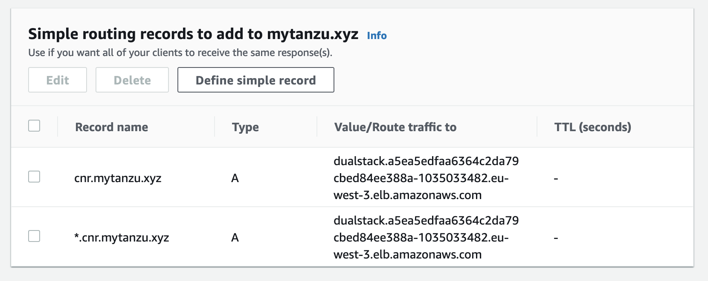

# micropets-app-operator

This repository gathers all the configurations that will be managed by an `app-operator` to provide on top a on an infrastructure-ready kubernetes cluster an application-ready cluster

1. Configure Cloud Native Build Pack
2. Configure Supply Chains for dev to turn a commit into a Kubernetes Configuration ready to be deployed
3. Configure Cloud Native Runtime (KNative)
4. Configure Tanzu Application Platform

## Cloud Native Build Pack

Set up the project to use [Cloud Native Buildpack](https://buildpacks.io/) instead of managing Dockerfile files to create the image

The project will use [kPack](https://github.com/pivotal/kpack). 

If you're looking for a supported version of [kPack](https://github.com/pivotal/kpack), please look at [Tanzu Build Service by vmware](https://tanzu.vmware.com/build-service)

### Install kPack into the cluster

```
kapp deploy --yes -a kpack -f https://github.com/pivotal/kpack/releases/download/v0.4.3/release-0.4.3.yaml

```

### Configure kPack 

Edit [kpack/kpack_values.yaml](kpack/kpack_valuesvalues.yaml) 
the kpack folder defines the cluster-scoped resources and the shared resources amongs the services

```
export MICROPETS_registry_password="moussaud"
kubectl create ns ${MICROPETS_into_ns}
ytt --ignore-unknown-comments --data-values-env  MICROPETS   -f . | kapp deploy --yes --into-ns ${MICROPETS_into_ns} -a micropet-kpack -f-
```

or

```
MICROPETS_registry_password="moussaud" make kpack
```

### Check the builder is available 

```
$kubectl get ClusterBuilder micropet-builder
NAME               LATESTIMAGE                                                                                                           READY
micropet-builder   harbor.mytanzu.xyz/library/micropet-builder@sha256:dd1993c5a5550f7b91052330d11bb029bd2f108776dff5097e42e813988ae1b9   True
```

in each service project, the `kpack.yaml` file specify what to build (Image). 
Run `make deploy-cnb` to apply the definition using the current kubernetes context (at the root of the project or individually)

_undeploy everything_

kapp delete -a micropet-kpack
kubectl delete  ns ${MICROPETS_into_ns}


## Configure Tanzu Application Platform

Instead of installing the component one by one (kpack, cartographer, knative), Tanzu Application Platform can be used instead.

Prerequisites are [Kapp Controler]() and [SecretGen Controler]()

```shell
kapp deploy -a kc -f https://github.com/vmware-tanzu/carvel-kapp-controller/releases/latest/download/release.yml -y
kapp deploy -a sc -f https://github.com/vmware-tanzu/carvel-secretgen-controller/releases/download/v0.8.0/release.yml -y
kubectl get deployments.apps -n kapp-controller kapp-controller -o yaml | rg "kapp-controller.carvel.dev/version"
````

* Rename [tap/tap-install-config.yml.tpl](tap/tap-install-config.yml.tpl) to [tap/tap-install-config.yml](tap/tap-install-config.yml) 
* Rename [tap/tap-install-secrets.yml.tpl](tap/tap-install-secrets.yml.tpl) to [tap/tap-install-secrets.yml](tap/tap-install-secrets.yml) 
* Provide the values for the tanzu registry,the target registry used by KPack, and the dns used for.

Make sure these files are not publicly available (for obvious reasons!).

You are now ready to apply the GitOps configuration (repository is the repository that will use these values)

```shell
kapp deploy -c -a tap-install-gitops -f <(ytt -f tap --data-value repository=https://github.com/bmoussaud/tap-install-gitops)
```

Then you can deploy the delivery & the supply chains

## Supply Chains

With a `ClusterSupplyChain`, the app operators describe which "shape of applications" they deal with (via `spec.selector`), and what series of components are responsible for creating an artifact that delivers it (via `spec.components`).

Those `Workload`s that match `spec.selector` then go through the components specified in `spec.components`.

The `micropet-service-supply-chain` supplychain manages the backend services : dogs, cats, fishes and pets.


it includes
1. Watch a repository using `fluxcd/GitRepository`
1. Build a new image using `kpack/Image`
1. Configure the application using `kubernetes/ConfigMap`
1. Trigger a deployment using `kapp-controler/kapp` 

All theses 4 resources are described in [supply-chain-templates.yaml](cluster/tap/app-operator/supply-chain-templates.yaml) and put together in [supply-chain.yaml](cluster/tap/app-operator/supply-chain.yaml)

Then each service must provide a new workload based on this supply chain. 

The association between a workload and the requested supplychain is based using labels: 
`app.tanzu.vmware.com/workload-type`.


Example: request A new workload called `micropet-service` with the following git repository using the `RANDOM_NUMBER` mode and listening on the `7003` port.

````
apiVersion: carto.run/v1alpha1
kind: Workload
metadata:
  name: dogs
  labels:
    app.tanzu.vmware.com/workload-type: micropet-service
spec:
  source:
    git:
      url: https://github.com/bmoussaud/micropets-app/
      ref:
        branch: master      
  params:
    - name: mode
      value: "RANDOM_NUMBER"
    - name: port
      value: 7003   
    - name: observability
      value: true   
````

apply this yaml definition and wacth

````
kubectl tree Workload dogs -n micropets-supplychain
Every 2,0s: kubectl tree Workload dogs -n micropets-supplychain                                                                           bmoussaud-a02.vmware.com: Fri Oct  1 16:02:08 2021

NAMESPACE              NAME                                             READY    REASON        AGE
micropets-supplychain  Workload/dogs                                    True     Ready         75s
micropets-supplychain  ├─App/dogs-application                           -                      25s
micropets-supplychain  ├─ConfigMap/micropet-service-dogs-config         -                      25s
micropets-supplychain  ├─GitRepository/micropet-dogs                    Unknown  Progressing   75s
micropets-supplychain  └─Image/micropet-dogs                            True                   70s
micropets-supplychain    ├─Build/micropet-dogs-build-1-tw6vt            -                      70s
micropets-supplychain    │ └─Pod/micropet-dogs-build-1-tw6vt-build-pod  False    PodCompleted  69s
micropets-supplychain    ├─PersistentVolumeClaim/micropet-dogs-cache    -                      70s
micropets-supplychain    └─SourceResolver/micropet-dogs-source          True                   70s

````

Several resources (kpack image, kapp-controler app, kubernetes config map, fluxcd git repository) are created and connected all together by the workload.

### install cartographer and other components

Source : https://cartographer.sh/docs/install/ 
v0.0.7

````
# fluxcd
kubectl create clusterrolebinding gitops-toolkit-admin --clusterrole=cluster-admin --serviceaccount=gitops-toolkit:default
kubectl create namespace gitops-toolkit
kapp deploy --yes -a gitops-toolkit --into-ns gitops-toolkit -f https://github.com/fluxcd/source-controller/releases/download/v0.15.4/source-controller.crds.yaml -f https://github.com/fluxcd/source-controller/releases/download/v0.15.4/source-controller.deployment.yaml
# cert-manager
kapp deploy -a cert-manager -f https://github.com/jetstack/cert-manager/releases/download/v1.6.1/cert-manager.yaml
# kapp-controler (if not there already)
kubectl create clusterrolebinding kapp-controler-admin --clusterrole=cluster-admin --serviceaccount=micropets-supplychain:default
kapp deploy -a kapp-controler -f https://github.com/vmware-tanzu/carvel-kapp-controller/releases/latest/download/release.yml
# cartographer
kubectl create namespace cartographer-system
kapp deploy -a cartographer -f https://github.com/vmware-tanzu/cartographer/releases/latest/download/cartographer.yaml
````

or 

```
make fluxcd cert-manager (kapp-controler) cartographer
````

### install the micropet Supply Chains

Edit [supplychains/app-operator/supply_chain_values.yaml](supplychains/app-operator/supply_chain_values.yaml) and change values.

```
---
image_prefix: library/micropet
registry:
  server: harbor.mytanzu.xyz
service:
  domain: micropets.europe.mytanzu.xyz
```

````
➜ make supplychain
kubectl create namespace micropets-supplychain --dry-run=client -o yaml | kubectl apply -f -
namespace/micropets-supplychain configured
kubectl get namespace micropets-supplychain
NAME                    STATUS   AGE
micropets-supplychain   Active   78m
ytt --ignore-unknown-comments -f supplychains/app-operator | kapp deploy --yes --dangerous-override-ownership-of-existing-resources --into-ns micropets-supplychain -a micropet-tap -f-
Target cluster 'https://aws-europe-apiserver-1113135057.eu-west-3.elb.amazonaws.com:6443' (nodes: ip-10-0-0-136.eu-west-3.compute.internal, 3+)

04:35:31PM: info: Resources: Ignoring group version: schema.GroupVersionResource{Group:"stats.antrea.tanzu.vmware.com", Version:"v1alpha1", Resource:"antreanetworkpolicystats"}: feature NetworkPolicyStats disabled
04:35:31PM: info: Resources: Ignoring group version: schema.GroupVersionResource{Group:"stats.antrea.tanzu.vmware.com", Version:"v1alpha1", Resource:"networkpolicystats"}: feature NetworkPolicyStats disabled
04:35:31PM: info: Resources: Ignoring group version: schema.GroupVersionResource{Group:"stats.antrea.tanzu.vmware.com", Version:"v1alpha1", Resource:"antreaclusternetworkpolicystats"}: feature NetworkPolicyStats disabled

Changes

Namespace  Name                                   Kind                   Conds.  Age  Op      Op st.  Wait to    Rs  Ri
(cluster)  micropet-deploy                        ClusterTemplate        -       -    create  -       reconcile  -   -
^          micropet-deploy-knative                ClusterTemplate        -       -    create  -       reconcile  -   -
^          micropet-gui-deploy                    ClusterTemplate        -       -    create  -       reconcile  -   -
^          micropet-gui-image                     ClusterImageTemplate   -       -    create  -       reconcile  -   -
^          micropet-gui-service-config            ClusterConfigTemplate  -       -    create  -       reconcile  -   -
^          micropet-gui-service-supply-chain      ClusterSupplyChain     -       -    create  -       reconcile  -   -
^          micropet-image                         ClusterImageTemplate   -       -    create  -       reconcile  -   -
^          micropet-service-config                ClusterConfigTemplate  -       -    create  -       reconcile  -   -
^          micropet-service-knative-supply-chain  ClusterSupplyChain     -       -    create  -       reconcile  -   -
^          micropet-service-supply-chain          ClusterSupplyChain     -       -    create  -       reconcile  -   -
^          micropet-source                        ClusterSourceTemplate  -       -    create  -       reconcile  -   -

Op:      11 create, 0 delete, 0 update, 0 noop
Wait to: 11 reconcile, 0 delete, 0 noop

4:35:31PM: ---- applying 11 changes [0/11 done] ----
4:35:31PM: create clustertemplate/micropet-gui-deploy (carto.run/v1alpha1) cluster
4:35:31PM: create clustersupplychain/micropet-service-supply-chain (carto.run/v1alpha1) cluster
4:35:31PM: create clustersupplychain/micropet-service-knative-supply-chain (carto.run/v1alpha1) cluster
4:35:31PM: create clusterconfigtemplate/micropet-gui-service-config (carto.run/v1alpha1) cluster
4:35:31PM: create clusterimagetemplate/micropet-image (carto.run/v1alpha1) cluster
4:35:31PM: create clustersupplychain/micropet-gui-service-supply-chain (carto.run/v1alpha1) cluster
4:35:31PM: create clustertemplate/micropet-deploy-knative (carto.run/v1alpha1) cluster
4:35:31PM: create clusterimagetemplate/micropet-gui-image (carto.run/v1alpha1) cluster
4:35:31PM: create clusterconfigtemplate/micropet-service-config (carto.run/v1alpha1) cluster
4:35:31PM: create clustersourcetemplate/micropet-source (carto.run/v1alpha1) cluster
4:35:31PM: create clustertemplate/micropet-deploy (carto.run/v1alpha1) cluster
4:35:31PM: ---- waiting on 11 changes [0/11 done] ----
4:35:31PM: ok: reconcile clustertemplate/micropet-gui-deploy (carto.run/v1alpha1) cluster
4:35:31PM: ok: reconcile clusterimagetemplate/micropet-image (carto.run/v1alpha1) cluster
4:35:31PM: ok: reconcile clusterimagetemplate/micropet-gui-image (carto.run/v1alpha1) cluster
4:35:31PM: ok: reconcile clustertemplate/micropet-deploy (carto.run/v1alpha1) cluster
4:35:31PM: ok: reconcile clustersupplychain/micropet-gui-service-supply-chain (carto.run/v1alpha1) cluster
4:35:31PM: ok: reconcile clusterconfigtemplate/micropet-service-config (carto.run/v1alpha1) cluster
4:35:31PM: ok: reconcile clustertemplate/micropet-deploy-knative (carto.run/v1alpha1) cluster
4:35:31PM: ok: reconcile clustersupplychain/micropet-service-knative-supply-chain (carto.run/v1alpha1) cluster
4:35:31PM: ok: reconcile clustersupplychain/micropet-service-supply-chain (carto.run/v1alpha1) cluster
4:35:31PM: ok: reconcile clustersourcetemplate/micropet-source (carto.run/v1alpha1) cluster
4:35:32PM: ok: reconcile clusterconfigtemplate/micropet-gui-service-config (carto.run/v1alpha1) cluster
4:35:32PM: ---- applying complete [11/11 done] ----
4:35:32PM: ---- waiting complete [11/11 done] ----

Succeeded
````


## Cloud Native Runtime / KNative

### Core
````
kapp deploy -n default -a knative-serving-1.0 -f https://github.com/knative/serving/releases/download/knative-v1.0.0/serving-crds.yaml -f https://github.com/knative/serving/releases/download/knative-v1.0.0/serving-core.yaml
````
Ref: https://knative.dev/docs/install/serving/install-serving-with-yaml/

### Istio 
If `Istio` hasn't been [installed](https://istio.io/latest/docs/setup/getting-started/#download)
````
$kubectl create ns istio-system
$istioctl install --set profile=default -y
➜ istioctl install --set profile=default -y
✔ Istio core installed
✔ Istiod installed
✔ Ingress gateways installed
✔ Installation complete
````

### Configure DNS

Ref: https://knative.dev/docs/install/serving/install-serving-with-yaml/#configure-dns

Fetch the External IP address or CNAME by running the command:
````
➜ kubectl --namespace istio-system get service istio-ingressgateway

NAME                   TYPE           CLUSTER-IP       EXTERNAL-IP                                                               PORT(S)                                      AGE
istio-ingressgateway   LoadBalancer   10.101.243.102   a5ea5edbenoita79cbed84ee388a-1045033682.eu-west-3.elb.amazonaws.com   15021:30542/TCP,80:31378/TCP,443:30205/TCP   3m28s
````

`*.cnr.mytanzu.xyz` and `cnr.mytanzu.xyz` defined in AWS


Put this value in [knative/values.yaml](knative/values.yaml)


### Deploy Knative / Istio 

The following command deploy __knative 1.0.0__ with the istio configuration.
Moreover, with ytt, it overlays the configuration to configure the `k-services` to
* to use a custom domain name (here cnr.mytanzu.xyz)
* to use be exposed using either the default configuration ({{.Name}}-{{.Namespace}}.{{.Domain}}) or by reading the `service.subdomain` annotation set on the service.

````
ytt --ignore-unknown-comments -f knative \
		-f https://github.com/knative/serving/releases/download/knative-v1.0.0/serving-crds.yaml  \
		-f https://github.com/knative/serving/releases/download/knative-v1.0.0/serving-core.yaml  \
		-f https://github.com/knative/net-istio/releases/download/knative-v1.0.0/net-istio.yaml   \
	| kapp deploy --yes -n default -a knative-serving-1.0 -f-
	kubectl --namespace istio-system get service istio-ingressgateway
````

Check the configuration using :

````
kubectl get cm  -n knative-serving config-network  -o yaml
kubectl get cm  -n knative-serving config-domain  -o yaml
````


## Deploy Deliverable & ClusterDelivery

### Concepts

Provided by the [https://cartographer.sh](https://cartographer.sh) project,

* _Deliverable_ allows the operator to pass information about the configuration to be applied to the environment to the delivery. 

* A _ClusterDelivery_ is a cluster-scoped resources that enables application operators to define a continuous delivery workflow. Delivery is analogous to SupplyChain, in that it specifies a list of resources that are created when requested by the developer. Early resources in the delivery are expected to configure the k8s environment (for example by deploying an application). Later resources validate the environment is healthy.


### Procedure

Note 1: If your cluster has already been enrolled by TSM (Tanzu Service Mesh), exclude the following namespaces
* cartographer-system
* cert-manager
* cartographer

Note 2: create an AKS Cluster using `--network-plugin="azure"`and `--network-policy="calico"` (https://fluxcd.io/docs/use-cases/azure/)

Ex:
````
az group create --location eastus --resource-group aks-east-coast-2
az aks create \
 --network-plugin="azure" \
 --network-policy="calico" \
 --node-count 5 \
 --enable-managed-identity \
 --name="aks-east-coast-2" \
 --resource-group "aks-east-coast-2"
````

Note 3: if your cluster is a TKGm 1.4, Follow [this documentation](https://docs.vmware.com/en/VMware-Tanzu-Application-Platform/0.4/tap/GUID-install-tkg.html#kapp-controller) to pause it.
* connect the management cluster 
* kubectl patch app/<WORKLOAD-CLUSTER>-kapp-controller -n default -p '{"spec":{"paused":true}}' --type=merge
* connect the workload cluster 
* kubectl delete deployment kapp-controller -n tkg-system

```
kapp delete -a <clustername>-kapp-controller-ctrl
```

1. Deploy the mandatory components:

````
make fluxcd cert-manager cartographer kapp-controler(-tkgm) 
````

2. Check with the ` kapp list` all the packages have been deployed.
````
➜ kapp list                                                                                                                                                                         
Target cluster 'https://xxxxx-aws-xxxx-apiserver-1764530553.eu-west-3.elb.amazonaws.com:6443' (nodes: 3+)

Apps in namespace 'default'

Name                                       Namespaces                             Lcs   Lca
bmoussaud-aws-europ2-kapp-controller-ctrl  (cluster),kube-system,tkg-system       true  48m
cartographer                               (cluster),cartographer-system          true  2m
cert-manager                               (cluster),cert-manager,kube-system     true  3m
gitops-toolkit                             (cluster),gitops-toolkit               true  48m
kapp-controler                             (cluster),kapp-controller,kube-system  true  47m
`````

3. Deploy the Delivery. 

````
make namespace delivery
````

The command-line above generates secrets based on 2 files:
* `~/.ssh/id_rsa for the key` (env SSH_KEY_FILE)
* `~/.ssh/known_hosts_github` for the known_hosts (env SSH_KNOWN_HOST_FILE)
you can set the associated env in front of the make command: `SSH_KNOWN_HOST_FILE=~/.ssh/known_hosts make delivery`

4. Create a deliverable per service (cats,dogs,fishes,pets,gui)

````
cd repository 
make deliverables ENV=env/europe-3
````

